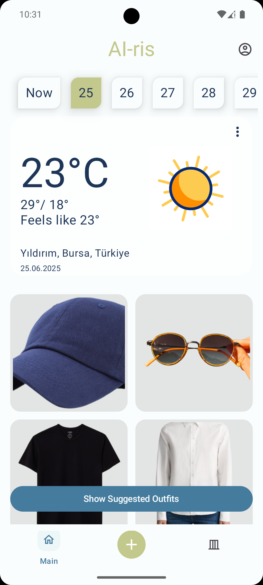
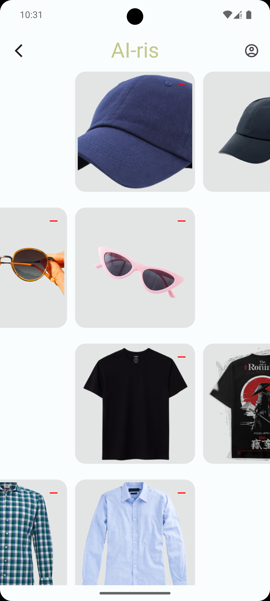
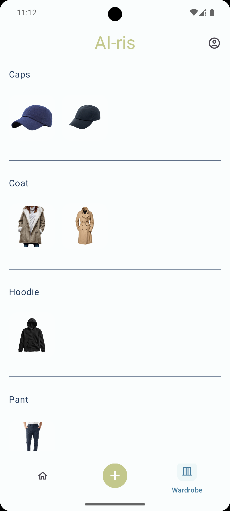

# 🌦️ AI-ris - Hava Durumuna Göre Kıyafet Öneri Uygulaması

AI-ris, kullanıcıların konumlarına ve anlık hava durumuna göre uygun kıyafet kategorileri öneren bir mobil uygulamadır. Derin öğrenme desteğiyle çalışır ve kullanıcıya günün hava koşullarına göre ne giymesi gerektiği konusunda kişiselleştirilmiş tavsiyelerde bulunur.

##  Özellikler

- 📍 Anlık konumdan 15 günlük hava durumu verisi alma
- 🌡️ Hava koşullarına göre kıyafet önerisi
- 📷 Kullanıcının eklediği kıyafet fotoğrafından derin öğrenme modeli ile kategori tahmini
- 🧥 Giysi arşivi oluşturma
- 💡 Temiz ve sezgisel arayüz (Jetpack Compose)

## 🛠️ Kullanılan Teknolojiler

- **Android (Kotlin)**
- **Jetpack Compose** – Modern UI tasarımı
- **DL / CNN / TensorFlow Lite** – Görsel tanıma
- **Retrofit** – API istekleri için
- **Hilt** – Dependency Injection
- **VisualCrossing API** – Hava durumu verileri
- **RemoveBackground API** – Eklenen resimlerin arka planını silme
- **Firebase Authentication** – Google ile giriş
- **Firebase Firestore** – Bulut veritabanı


## 📸 Ekran Görüntüleri

### Giriş Sayfası


### Ana Sayfa


### Kıyafet Öneri Sayfası


### Gardırop Sayfası


## 📦 Kurulum

1. Bu repoyu klonlayın:
   ```bash
   git clone https://github.com/anacbetul/Aeris.git

Android Studio ile açın.

local.properties dosyasına [VisualCrossing](https://www.visualcrossing.com/) API anahtarınızı ve [RemoveBackground](https://www.remove.bg/) API anahtarınızı ekleyin:

    WEATHER_API_KEY=your_weather_api_key_here
    REMOVE_BG_API_KEY=your_removebg_api_key_here

Gerekli SDK'ların ve bağımlılıkların yüklü olduğundan emin olun.

### 🔐 Firebase & Google Girişi Kurulumu

1️⃣ Firebase Projesi Oluştur

Firebase Console üzerinden yeni bir proje oluşturun.

Android uygulamanızı ekleyin.

SHA-1 sertifika anahtarınızı girin.

google-services.json dosyasını indirip app/ klasörüne ekleyin.

2️⃣ Google ile Giriş (Authentication)

Authentication > Sign-in method kısmına gidin.

Google yöntemini etkinleştirin.

Destek e-posta adresini girin.

strings.xml dosyasına default_web_client_id ekleyin:

    <string name="default_web_client_id">your_client_id_here</string>

3️⃣ Firestore (Bulut Veritabanı)

Firebase Console'da Firestore Database sekmesine gidin.

"Veritabanı oluştur" butonuna tıklayarak veritabanını başlatın (production veya test modu seçebilirsiniz).

Uygulamada kullanıcı verilerini (örneğin kıyafet arşivi) Firestore ile saklayabilirsiniz.

Uygulamayı çalıştırın (Run > Run 'app')


# 👩‍💻 Geliştiriciler

###### **Betül Anaçoğlu**
📍Computer Engineer
🔗 [LinkedIn](www.linkedin.com/in/betul-anacoglu)
📧 betul.anacoglu@gmail.com

###### **Furkan Kazım Çam**
📍 Computer Engineer
🔗 [LinkedIn](https://www.linkedin.com/in/furkan-kazim-cam/)
📧 dev.furkankazimcam@gmail.com